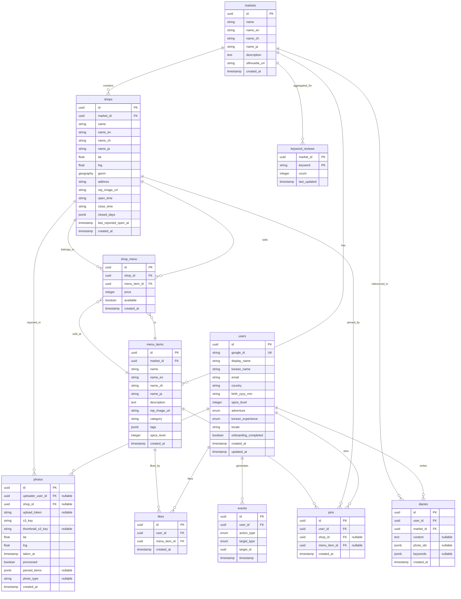

# 데이터베이스 ERD (Entity Relationship Diagram)

## 개요

이 문서는 시장 탐방 서비스의 데이터베이스 엔티티 관계 다이어그램입니다.

---

## 전체 ERD



---

## 관계 설명

### 1. 사용자 (users) 중심 관계

```
users (1) ────< (N) photos          : 사용자는 여러 사진을 업로드할 수 있음
users (1) ────< (N) likes           : 사용자는 여러 메뉴에 좋아요를 누를 수 있음
users (1) ────< (N) pins            : 사용자는 여러 가게/메뉴를 핀할 수 있음
users (1) ────< (N) diaries         : 사용자는 여러 다이어리를 작성할 수 있음
users (1) ────< (N) events          : 사용자는 여러 이벤트를 발생시킬 수 있음
```

**특징:**
- `photos.uploader_user_id`는 NULL 가능 (비회원 제보 지원)
- `likes`는 사용자-메뉴별로 UNIQUE (중복 좋아요 방지)

---

### 2. 시장 (markets) 중심 관계

```
markets (1) ────< (N) shops            : 시장은 여러 가게를 포함
markets (1) ────< (N) menu_items       : 시장은 여러 메뉴 아이템을 가짐
markets (1) ────< (N) diaries          : 시장은 여러 다이어리에서 언급됨
markets (1) ────< (N) keyword_reviews  : 시장별 키워드 리뷰 집계
```

**특징:**
- `keyword_reviews`는 복합 기본 키 `(market_id, keyword)`

---

### 3. 가게 (shops) 중심 관계

```
shops (1) ────< (N) shop_menu    : 가게는 여러 메뉴를 판매 (다대다)
shops (1) ────< (N) photos       : 가게는 여러 사진에 제보/리뷰됨
shops (1) ────< (N) pins         : 가게는 여러 사용자에게 핀됨
```

**특징:**
- `shops.geom`은 PostGIS Geography 타입으로 공간 검색 지원
- `shops.last_reported_open_at`으로 실시간 영업 상태 추정

---

### 4. 메뉴 아이템 (menu_items) 중심 관계

```
menu_items (1) ────< (N) shop_menu  : 메뉴는 여러 가게에서 판매됨 (다대다)
menu_items (1) ────< (N) likes      : 메뉴는 여러 사용자에게 좋아요 받음
menu_items (1) ────< (N) pins       : 메뉴는 여러 사용자에게 핀됨
```

**특징:**
- `shop_menu`는 조인 테이블로 가게-메뉴의 다대다 관계 표현
- 같은 메뉴라도 가게마다 가격이 다를 수 있음

---

### 5. 사진 (photos) 관계

```
photos (N) ────> (1) users  : 사진은 한 명의 사용자가 업로드 (NULL 가능)
photos (N) ────> (1) shops  : 사진은 한 가게를 제보/리뷰 (NULL 가능)
```

**특징:**
- 비회원 제보 지원: `uploader_user_id`는 NULL 가능
- 제보 완료 전까지는 `shop_id`가 NULL일 수 있음
- `photo_type`으로 'report' (제보용) 또는 'review' (리뷰용) 구분

---

### 6. 핀 (pins) 관계

```
pins (N) ────> (1) users       : 핀은 한 명의 사용자가 생성
pins (N) ────> (1) shops       : 핀은 한 가게를 참조 (NULL 가능)
pins (N) ────> (1) menu_items  : 핀은 한 메뉴를 참조 (NULL 가능)
```

**특징:**
- `shop_id`와 `menu_item_id` 중 하나는 반드시 있어야 함 (애플리케이션 레벨 검증)

---

## 주요 관계도

### 시장-가게-메뉴 관계

```
markets
  │
  ├── shops (가게들)
  │     │
  │     └── shop_menu ──── menu_items
  │
  └── menu_items (메뉴들)
        │
        └── shop_menu ──── shops
```

### 사용자-콘텐츠 관계

```
users
  │
  ├── photos (업로드한 사진)
  │     └── shops (제보/리뷰된 가게)
  │
  ├── likes (좋아요한 메뉴)
  │     └── menu_items
  │
  ├── pins (핀한 가게/메뉴)
  │     ├── shops
  │     └── menu_items
  │
  └── diaries (작성한 다이어리)
        └── markets
```

---

## 데이터 흐름도

### 사진 업로드 플로우

```
1. 사용자 촬영
   ↓
2. photos 테이블에 레코드 생성 (processed = FALSE)
   ↓
3. Celery 작업 큐에 추가
   ↓
4. 이미지 분석 (OpenAI)
   ↓
5. 메뉴 매칭 (MenuMatcher)
   ↓
6. parsed_items 업데이트
   ↓
7. processed = TRUE
```

### 제보 완료 플로우

```
1. 사용자가 가게 선택
   ↓
2. photos.shop_id 업데이트
   ↓
3. shops.last_reported_open_at 업데이트
```

### 다이어리 작성 플로우

```
1. 사용자가 다이어리 작성
   ↓
2. diaries 테이블에 레코드 생성
   ↓
3. keyword_reviews 업데이트 (키워드 집계)
   ↓
4. events 테이블에 이벤트 기록
```

---

## 참고 사항

1. **NULL 허용**: 
   - `photos.uploader_user_id` (비회원 제보)
   - `photos.shop_id` (제보 완료 전)
   - `pins.shop_id` 또는 `pins.menu_item_id` (둘 중 하나만)

2. **UNIQUE 제약**:
   - `users.google_id`
   - `likes(user_id, menu_item_id)`
   - `keyword_reviews(market_id, keyword)` (복합 PK)

3. **JSONB 필드**:
   - `shops.closed_days`: 휴무일 배열
   - `photos.parsed_items`: 파싱된 음식 정보
   - `diaries.photo_ids`: 사진 ID 배열
   - `diaries.keywords`: 키워드 배열

4. **공간 데이터**:
   - `shops.geom`: PostGIS Geography 타입
   - 거리 기반 검색 지원

---

## 테이블별 카디널리티

| 테이블 | 예상 레코드 수 | 비고 |
|--------|---------------|------|
| users | 수백~수천 | 사용자 수에 따라 |
| markets | 10~100 | 시장 개수는 제한적 |
| shops | 수백~수천 | 시장당 평균 10~50개 가게 |
| menu_items | 수백~수천 | 시장당 평균 20~100개 메뉴 |
| shop_menu | 수천~수만 | 가게-메뉴 조인 |
| photos | 수만~수십만 | 계속 증가 |
| likes | 수만 | 사용자-메뉴 조인 |
| pins | 수천 | 사용자-가게/메뉴 조인 |
| diaries | 수천 | 사용자별 평균 1~10개 |
| keyword_reviews | 수백 | 시장-키워드 조합 |
| events | 수만~수십만 | 모든 사용자 행동 로그 |

---

## 인덱스 전략

### 클러스터 인덱스
- `photos.created_at` (DESC) - 최신 사진 조회 빈번
- `shops.market_id` - 시장별 가게 조회

### 보조 인덱스
- 공간 인덱스: `shops.geom` (GIST)
- 해시 인덱스: `users.google_id`, `photos.upload_token`
- B-tree 인덱스: 모든 FK, 타임스탬프, 카테고리 등

---

이 ERD는 Mermaid 다이어그램 형식으로 작성되었습니다. GitHub나 Mermaid 지원 에디터에서 시각적으로 확인할 수 있습니다.

