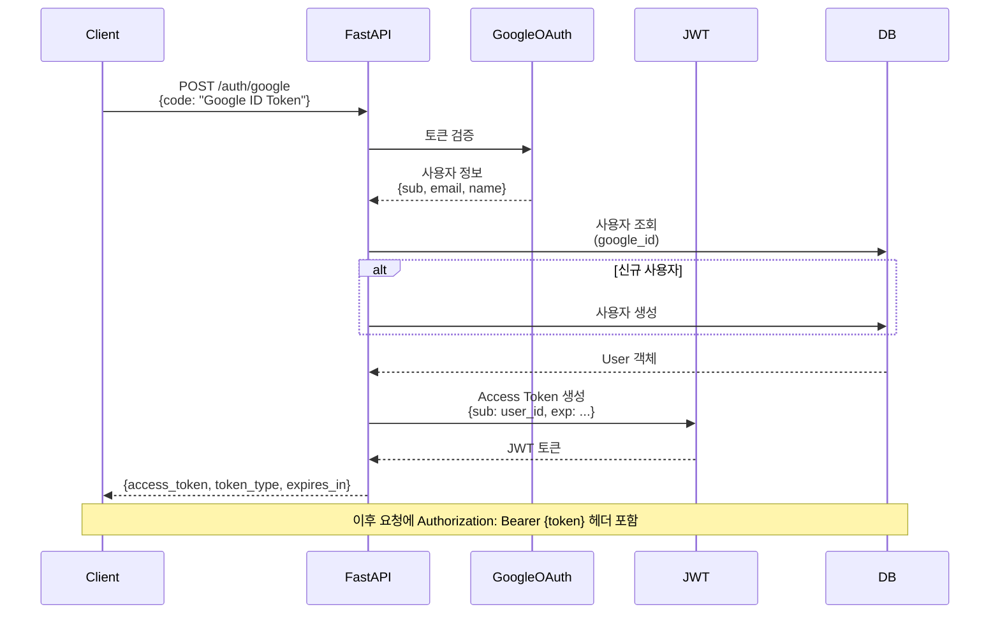
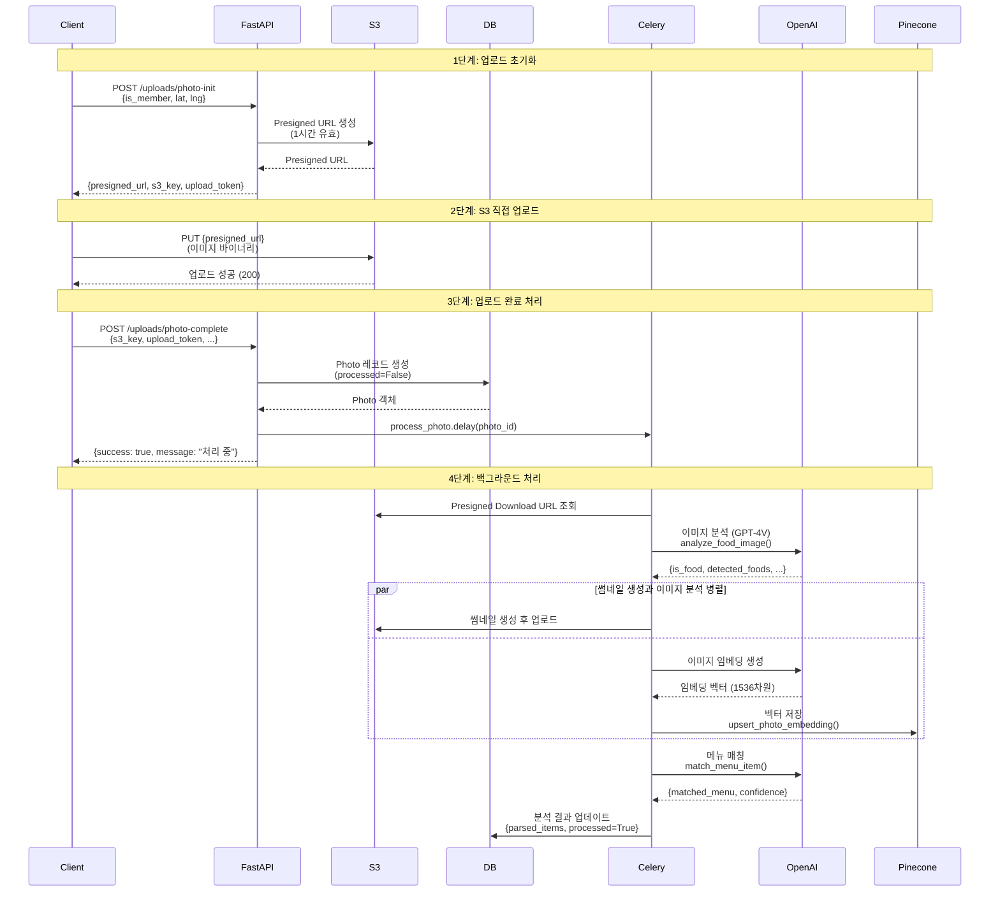
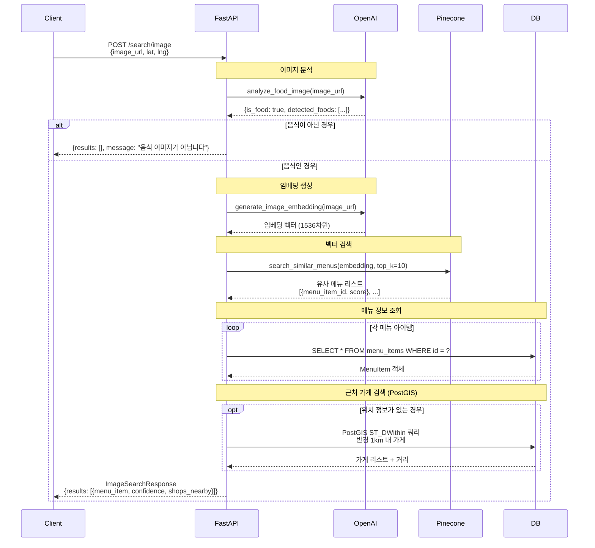
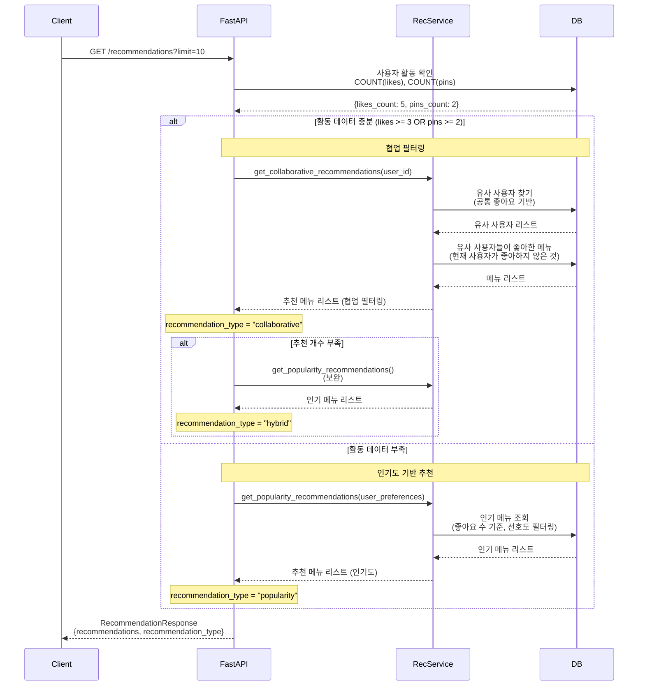
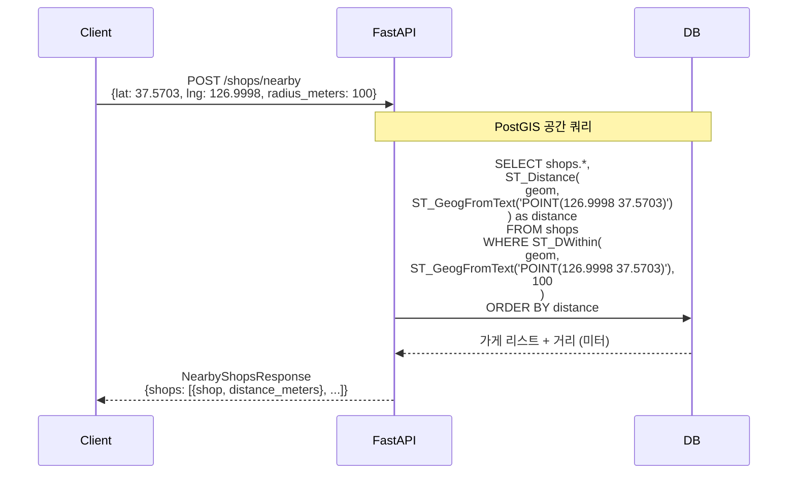
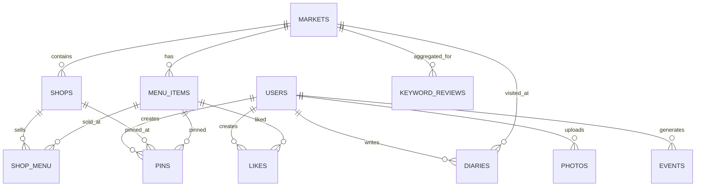

# 🏗️ 시장 탐방 서비스 시스템 아키텍처

## 📐 전체 시스템 아키텍처 다이어그램

```mermaid
graph TB
    subgraph "클라이언트 레이어"
        FlutterApp[Flutter 모바일 앱]
        WebApp[웹 클라이언트]
        AdminPanel[관리자 패널]
    end

    subgraph "API Gateway 레이어"
        FastAPI[FastAPI 서버<br/>:8000<br/>- CORS 미들웨어<br/>- JWT 인증<br/>- 요청 라우팅<br/>- Swagger UI]
    end

    subgraph "인증 시스템"
        GoogleOAuth[Google OAuth 2.0]
        JWTService[JWT 토큰 서비스<br/>- Access Token 생성<br/>- 토큰 검증<br/>- 토큰 갱신]
    end

    subgraph "API 라우터 레이어"
        AuthRouter[/auth<br/>- POST /google<br/>- GET /me<br/>- POST /refresh]
        UserRouter[/users<br/>- GET /profile<br/>- PUT /profile<br/>- POST /onboarding]
        MarketRouter[/markets<br/>- GET /<br/>- GET /{id}<br/>- GET /{id}/stats]
        ShopRouter[/shops<br/>- POST /nearby<br/>- GET /{id}<br/>- GET /{id}/menu]
        PhotoRouter[/uploads<br/>- POST /photo-init<br/>- POST /photo-complete<br/>- GET /my-photos]
        SearchRouter[/search<br/>- POST /image<br/>- GET /menu-items<br/>- GET /popular-menus]
        RecRouter[/recommendations<br/>- GET /<br/>- GET /trending<br/>- POST /feedback]
        DiaryRouter[/diary<br/>- POST /<br/>- GET /my<br/>- POST /likes]
    end

    subgraph "서비스 레이어"
        OpenAIService[OpenAI Service<br/>- 이미지 분석 GPT-4V<br/>- 임베딩 생성<br/>- 메뉴 매칭]
        PineconeService[Pinecone Service<br/>- 벡터 검색<br/>- 임베딩 저장<br/>- 유사도 검색]
        S3Service[S3 Service<br/>- Presigned URL 생성<br/>- 파일 업로드/다운로드<br/>- 객체 삭제]
        RecService[Recommendation Service<br/>- 협업 필터링<br/>- 인기도 기반<br/>- 콜드 스타트]
    end

    subgraph "비동기 작업 큐"
        CeleryWorker[Celery Worker<br/>- 사진 처리<br/>- 이미지 분석<br/>- 썸네일 생성<br/>- 메뉴 매칭]
        CeleryBeat[Celery Beat<br/>- 추천 업데이트 매일<br/>- 키워드 집계 매시간<br/>- 사진 정리 매일]
        RedisQueue[(Redis<br/>- 작업 큐 Broker<br/>- 결과 Backend<br/>- 캐시 저장소<br/>- 세션 저장)]
    end

    subgraph "데이터 저장소"
        PostgreSQL[(PostgreSQL 15+<br/>PostGIS 확장<br/>- users<br/>- markets<br/>- shops<br/>- menu_items<br/>- photos<br/>- likes/pins<br/>- diaries<br/>- events)]
        MinIO[(MinIO/S3<br/>객체 스토리지<br/>- photos/<br/>- thumbnails/<br/>이미지 파일)]
        PineconeDB[(Pinecone<br/>벡터 데이터베이스<br/>- 메뉴 임베딩<br/>- 사진 임베딩<br/>- 유사도 검색)]
    end

    subgraph "외부 API"
        OpenAIAPI[OpenAI API<br/>GPT-4V<br/>text-embedding-ada-002]
        PineconeAPI[Pinecone API<br/>벡터 업로드<br/>유사도 검색]
    end

    %% 클라이언트 → API Gateway
    FlutterApp -->|HTTPS REST API| FastAPI
    WebApp -->|HTTPS REST API| FastAPI
    AdminPanel -->|HTTPS REST API| FastAPI

    %% API Gateway → 라우터
    FastAPI --> AuthRouter
    FastAPI --> UserRouter
    FastAPI --> MarketRouter
    FastAPI --> ShopRouter
    FastAPI --> PhotoRouter
    FastAPI --> SearchRouter
    FastAPI --> RecRouter
    FastAPI --> DiaryRouter

    %% 인증 흐름
    AuthRouter --> GoogleOAuth
    AuthRouter --> JWTService
    FastAPI -.->|토큰 검증| JWTService
    AuthRouter --> PostgreSQL
    UserRouter --> PostgreSQL

    %% 라우터 → 서비스
    PhotoRouter --> S3Service
    SearchRouter --> OpenAIService
    SearchRouter --> PineconeService
    RecRouter --> RecService
    PhotoRouter -.->|비동기 작업| CeleryWorker
    ShopRouter --> PostgreSQL

    %% 서비스 → 외부 API
    OpenAIService --> OpenAIAPI
    PineconeService --> PineconeAPI

    %% 서비스 → 저장소
    S3Service --> MinIO
    OpenAIService -.->|임베딩 저장| PineconeService
    PineconeService --> PineconeDB

    %% 라우터 → 데이터베이스
    MarketRouter --> PostgreSQL
    ShopRouter --> PostgreSQL
    PhotoRouter --> PostgreSQL
    SearchRouter --> PostgreSQL
    RecRouter --> PostgreSQL
    DiaryRouter --> PostgreSQL

    %% 서비스 → 데이터베이스
    RecService --> PostgreSQL
    S3Service -.->|메타데이터| PostgreSQL

    %% 비동기 작업 흐름
    CeleryWorker --> RedisQueue
    CeleryBeat --> RedisQueue
    CeleryWorker --> OpenAIService
    CeleryWorker --> PineconeService
    CeleryWorker --> S3Service
    CeleryWorker --> PostgreSQL

    style FastAPI fill:#009485,color:#fff
    style PostgreSQL fill:#336791,color:#fff
    style RedisQueue fill:#DC382D,color:#fff
    style MinIO fill:#FF6B6B,color:#fff
    style PineconeDB fill:#4A9BFF,color:#fff
    style OpenAIAPI fill:#10A37F,color:#fff
```

## 🔄 주요 데이터 플로우

### 1. 사용자 인증 플로우



### 2. 사진 업로드 플로우



### 3. 이미지 검색 플로우



### 4. 추천 시스템 플로우



### 5. 근처 가게 검색 플로우 (PostGIS)



## 🗂️ 컴포넌트별 상세 구조

### FastAPI 애플리케이션 구조

```
backend/app/
├── main.py (FastAPI 앱 진입점)
│   ├── FastAPI 인스턴스 생성
│   ├── CORS 미들웨어 설정
│   ├── 이벤트 핸들러 (startup/shutdown)
│   └── API 라우터 등록
│
├── config.py (환경 설정)
│   ├── Settings 클래스 (Pydantic Settings)
│   ├── 환경 변수 로딩
│   └── 기본값 및 검증
│
├── db/
│   ├── database.py (DB 연결)
│   │   ├── SQLAlchemy Engine
│   │   ├── SessionLocal
│   │   └── get_db() 의존성 함수
│   │
│   └── models.py (DB 모델)
│       ├── User, Market, Shop
│       ├── MenuItem, ShopMenu
│       ├── Photo, Like, Pin
│       ├── Diary, Event
│       └── KeywordReview
│
├── models/
│   └── schemas.py (Pydantic 스키마)
│       ├── 요청/응답 모델
│       └── 데이터 검증
│
├── api/ (API 엔드포인트)
│   ├── auth.py (/auth)
│   ├── users.py (/users)
│   ├── markets.py (/markets)
│   ├── shops.py (/shops)
│   ├── photos.py (/uploads)
│   ├── search.py (/search)
│   ├── recommendations.py (/recommendations)
│   └── diary.py (/diary)
│
├── services/ (비즈니스 로직)
│   ├── openai_service.py
│   ├── pinecone_service.py
│   ├── s3_service.py
│   └── recommendation_service.py
│
└── tasks/ (Celery 작업)
    ├── celery_app.py (Celery 설정)
    ├── photo_tasks.py
    ├── recommendation_tasks.py
    └── maintenance_tasks.py
```

### API 엔드포인트 상세

#### 인증 API (`/auth`)

| Method | Endpoint | 설명 | 인증 필요 |
|--------|----------|------|----------|
| POST | `/auth/google` | Google OAuth 로그인 | ❌ |
| GET | `/auth/me` | 현재 사용자 정보 | ✅ |
| POST | `/auth/refresh` | 토큰 갱신 | ✅ |

#### 사용자 API (`/users`)

| Method | Endpoint | 설명 | 인증 필요 |
|--------|----------|------|----------|
| GET | `/users/profile` | 프로필 조회 | ✅ |
| PUT | `/users/profile` | 프로필 수정 | ✅ |
| POST | `/users/onboarding` | 온보딩 완료 | ✅ |

#### 시장 API (`/markets`)

| Method | Endpoint | 설명 | 인증 필요 |
|--------|----------|------|----------|
| GET | `/markets` | 시장 목록 | ❌ |
| GET | `/markets/{id}` | 시장 상세 | ❌ |
| GET | `/markets/{id}/menu-items` | 시장 메뉴 목록 | ❌ |
| GET | `/markets/{id}/stats` | 시장 통계 | ❌ |

#### 가게 API (`/shops`)

| Method | Endpoint | 설명 | 인증 필요 |
|--------|----------|------|----------|
| GET | `/shops` | 가게 목록 | ❌ |
| POST | `/shops/nearby` | 근처 가게 검색 (PostGIS) | ❌ |
| GET | `/shops/{id}` | 가게 상세 | ❌ |
| GET | `/shops/{id}/menu` | 가게 메뉴 조회 | ❌ |
| PUT | `/shops/{id}/report-open` | 영업 상태 보고 | ❌ |

#### 사진 업로드 API (`/uploads`)

| Method | Endpoint | 설명 | 인증 필요 |
|--------|----------|------|----------|
| POST | `/uploads/photo-init` | 업로드 초기화 (Presigned URL) | 선택적 |
| POST | `/uploads/photo-complete` | 업로드 완료 처리 | ❌ |
| GET | `/uploads/photo/{photo_id}` | 사진 정보 조회 | ❌ |
| GET | `/uploads/my-photos` | 내 사진 목록 | ✅ |
| DELETE | `/uploads/photo/{photo_id}` | 사진 삭제 | ✅ |

#### 검색 API (`/search`)

| Method | Endpoint | 설명 | 인증 필요 |
|--------|----------|------|----------|
| POST | `/search/image` | 이미지로 음식 검색 | ❌ |
| GET | `/search/menu-items` | 메뉴 텍스트 검색 | ❌ |
| GET | `/search/popular-menus` | 인기 메뉴 | ❌ |
| GET | `/search/trending-keywords` | 트렌딩 키워드 | ❌ |

#### 추천 API (`/recommendations`)

| Method | Endpoint | 설명 | 인증 필요 |
|--------|----------|------|----------|
| GET | `/recommendations` | 개인화 추천 | ✅ |
| GET | `/recommendations/similar-users` | 유사 사용자 기반 추천 | ✅ |
| GET | `/recommendations/trending` | 트렌딩 메뉴 | ✅ |
| GET | `/recommendations/for-beginners` | 초보자 추천 | ✅ |
| POST | `/recommendations/feedback` | 추천 피드백 | ✅ |

#### 다이어리 API (`/diary`)

| Method | Endpoint | 설명 | 인증 필요 |
|--------|----------|------|----------|
| POST | `/diary` | 다이어리 작성 | ✅ |
| GET | `/diary/my` | 내 다이어리 목록 | ✅ |
| POST | `/diary/likes` | 좋아요 추가 | ✅ |
| POST | `/diary/pins` | 핀 추가 | ✅ |

### 서비스 레이어 상세

#### OpenAIService

```python
class OpenAIService:
    def analyze_food_image(image_url: str) -> dict:
        """
        GPT-4V로 이미지 분석
        Returns:
            {
                "is_food": bool,
                "food_coverage": float (0.0-1.0),
                "food_count": int,
                "detected_foods": [
                    {
                        "name": str,
                        "confidence": float,
                        "bbox": [x1, y1, x2, y2],
                        "korean_name": str
                    }
                ],
                "is_suitable_for_display": bool
            }
        """
    
    def match_menu_item(image_url: str, menu_items: List[str], 
                       user_prompt: Optional[str]) -> dict:
        """
        메뉴 아이템과 매칭
        Returns:
            {
                "matched_menu": str | None,
                "confidence": float,
                "alternatives": List[str]
            }
        """
    
    def generate_embedding(text: str) -> List[float]:
        """text-embedding-ada-002로 텍스트 임베딩 생성"""
    
    def generate_image_embedding(image_url: str) -> List[float]:
        """이미지를 설명으로 변환 후 임베딩 생성"""
```

#### PineconeService

```python
class PineconeService:
    def upsert_menu_embedding(menu_item_id: str, embedding: List[float], 
                              metadata: dict) -> bool:
        """메뉴 임베딩을 벡터 DB에 저장"""
    
    def upsert_photo_embedding(photo_id: str, crop_index: int, 
                               embedding: List[float], metadata: dict) -> bool:
        """사진 임베딩을 벡터 DB에 저장"""
    
    def search_similar_menus(query_embedding: List[float], top_k: int) -> List[dict]:
        """코사인 유사도로 유사 메뉴 검색"""
    
    def search_similar_photos(query_embedding: List[float], top_k: int) -> List[dict]:
        """유사 사진 검색"""
    
    def batch_upsert_menu_embeddings(menu_embeddings: List[dict]) -> bool:
        """메뉴 임베딩 배치 업로드"""
```

#### S3Service

```python
class S3Service:
    def generate_presigned_upload_url(s3_key: str, expires_in: int) -> str:
        """업로드용 임시 URL 생성 (기본 1시간)"""
    
    def generate_presigned_download_url(s3_key: str, expires_in: int) -> str:
        """다운로드용 임시 URL 생성"""
    
    def upload_file(file_path: str, s3_key: str) -> bool:
        """파일 직접 업로드 (Celery 작업용)"""
    
    def delete_object(s3_key: str) -> bool:
        """객체 삭제"""
    
    def _ensure_bucket_exists() -> None:
        """버킷 존재 확인 및 생성"""
```

#### RecommendationService

```python
class RecommendationService:
    def get_collaborative_recommendations(user_id: str, limit: int) -> List[MenuItem]:
        """
        협업 필터링
        - 유사 취향 사용자 찾기
        - 유사 사용자가 좋아한 메뉴 추천
        """
    
    def get_popularity_recommendations(user_preferences: dict, limit: int) -> List[MenuItem]:
        """
        인기도 기반 추천
        - 전체 좋아요 수 기반
        - 사용자 선호도 필터링
        """
    
    def get_similar_users_recommendations(user_id: str, limit: int) -> List[MenuItem]:
        """
        유사 프로필 사용자 기반
        - 국가, 매운맛 수준, 모험 수준 비교
        """
    
    def get_content_based_recommendations(user_id: str, limit: int) -> List[MenuItem]:
        """
        콘텐츠 기반 추천
        - 좋아한 메뉴의 특성 분석
        - 유사 특성 메뉴 추천
        """
    
    def get_cold_start_recommendations(user_preferences: dict, limit: int) -> List[MenuItem]:
        """
        신규 사용자용 추천
        - 전체 인기 메뉴 중 선호도 기반 필터링
        """
```

### Celery 작업 상세

#### photo_tasks.py

```python
@celery_app.task
def process_photo(photo_id: str):
    """
    사진 처리 메인 작업
    - 썸네일 생성
    - 이미지 분석
    """
    generate_thumbnails.delay(photo_id, image_url)
    analyze_image_with_openai.delay(photo_id, image_url)

@celery_app.task
def generate_thumbnails(photo_id: str, image_url: str):
    """
    썸네일 생성
    - 300x300, 150x150 크기
    - S3에 업로드
    """

@celery_app.task
def analyze_image_with_openai(photo_id: str, image_url: str):
    """
    OpenAI 이미지 분석
    - GPT-4V로 분석
    - 메뉴 매칭 필요시 match_with_menu_items 호출
    """

@celery_app.task
def match_with_menu_items(photo_id: str, image_url: str, analysis_result: dict):
    """
    메뉴 아이템과 매칭
    - 각 감지된 음식에 대해 메뉴 매칭
    - 임베딩 생성 후 Pinecone 저장
    """

@celery_app.task
def batch_process_menu_embeddings():
    """
    메뉴 아이템 임베딩 배치 처리
    - 모든 메뉴의 임베딩 생성
    - Pinecone에 배치 업로드
    """
```

#### recommendation_tasks.py

```python
@celery_app.task
def update_collaborative_filtering():
    """
    추천 모델 업데이트
    - 스케줄: 매일 새벽 2시
    - 협업 필터링 모델 재학습
    """
```

#### maintenance_tasks.py

```python
@celery_app.task
def aggregate_keyword_reviews():
    """
    키워드 리뷰 집계
    - 스케줄: 매시간
    - 다이어리 키워드를 집계하여 KEYWORD_REVIEWS 업데이트
    """

@celery_app.task
def cleanup_old_photos():
    """
    오래된 사진 정리
    - 스케줄: 매일
    - 180일 이상 된 사진 삭제 (설정값: PHOTO_RETENTION_DAYS)
    """
```

## 🗄️ 데이터베이스 스키마

### 주요 테이블 관계도



### 테이블별 주요 컬럼

#### users
- `id` (UUID, PK)
- `google_id` (String, UNIQUE)
- `display_name`, `korean_name`, `email`
- `country`, `birth_yyyy_mm`
- `spice_level` (1-5), `adventure` (enum), `korean_experience` (enum)
- `locale` (ko, en, zh, ja)

#### shops (PostGIS)
- `id` (UUID, PK)
- `market_id` (UUID, FK)
- `name`, `name_en`, `name_zh`, `name_ja`
- `lat`, `lng` (Float)
- `geom` (Geography('POINT')) ← PostGIS
- `last_reported_open_at` (Timestamp)

#### menu_items
- `id` (UUID, PK)
- `market_id` (UUID, FK)
- `name`, `name_en`, `name_zh`, `name_ja`
- `description` (Text)
- `tags` (JSONB) ← 유연한 메타데이터
- `spice_level` (1-5)

#### photos
- `id` (UUID, PK)
- `uploader_user_id` (UUID, FK, nullable)
- `upload_token` (String, nullable) ← 비회원용
- `s3_key` (String)
- `thumbnail_s3_key` (String, nullable)
- `lat`, `lng` (Float)
- `taken_at` (Timestamp)
- `processed` (Boolean)
- `parsed_items` (JSONB) ← AI 분석 결과

## 🐳 Docker Compose 아키텍처

```yaml
services:
  # FastAPI 애플리케이션
  api:
    build: .
    ports: ["8000:8000"]
    depends_on: [postgres, redis, minio]
    environment:
      - DATABASE_URL=postgresql://...
      - REDIS_URL=redis://redis:6379/0
      - CELERY_BROKER_URL=redis://redis:6379/0
      - S3_ENDPOINT_URL=http://minio:9000
  
  # PostgreSQL + PostGIS
  postgres:
    image: postgis/postgis:15-3.3
    ports: ["5432:5432"]
    volumes: [postgres_data:/var/lib/postgresql/data]
    environment:
      - POSTGRES_DB=market_explorer
      - POSTGRES_USER=postgres
  
  # Redis (큐 + 캐시)
  redis:
    image: redis:7-alpine
    ports: ["6379:6379"]
    volumes: [redis_data:/data]
  
  # MinIO (S3 호환)
  minio:
    image: minio/minio:latest
    ports: ["9000:9000", "9001:9001"]
    volumes: [minio_data:/data]
    command: server /data --console-address ":9001"
  
  # Celery Worker
  celery_worker:
    build: .
    command: celery -A app.tasks.celery_app worker --loglevel=info
    depends_on: [postgres, redis]
  
  # Celery Beat (스케줄러)
  celery_beat:
    build: .
    command: celery -A app.tasks.celery_app beat --loglevel=info
    depends_on: [postgres, redis]

networks:
  market_explorer_network:
    driver: bridge

volumes:
  postgres_data:
  redis_data:
  minio_data:
```

## 🔐 보안 아키텍처

```
보안 레이어
├── 인증 (Authentication)
│   ├── Google OAuth 2.0 (소셜 로그인)
│   ├── JWT Access Token (30분 만료)
│   └── Token Refresh
│
├── 권한 (Authorization)
│   ├── 회원/비회원 구분 (is_member 플래그)
│   └── 리소스별 접근 제어
│
├── 데이터 보안
│   ├── S3 Presigned URL (임시 접근, 1시간)
│   ├── 환경 변수로 API 키 관리
│   └── HTTPS 통신
│
└── CORS 정책
    └── ALLOWED_ORIGINS 환경 변수로 제어
```

## 📊 외부 서비스 연동

### OpenAI API
- **모델**: GPT-4V (이미지 분석), text-embedding-ada-002 (임베딩)
- **용도**: 이미지 분석, 메뉴 매칭, 임베딩 생성
- **비용 관리**: API 호출 최적화, 결과 캐싱

### Pinecone
- **인덱스**: market-explorer
- **차원**: 1536 (ada-002 임베딩)
- **메트릭**: cosine similarity
- **용도**: 메뉴/사진 유사도 검색

### MinIO (로컬) / AWS S3 (프로덕션)
- **버킷**: market-explorer-photos
- **구조**: 
  - `photos/` - 원본 사진
  - `thumbnails/` - 썸네일
- **접근**: Presigned URL로 임시 접근

## 🚀 확장성 전략

### 수평 확장 가능 영역
1. **FastAPI 서버**: 여러 인스턴스 + 로드 밸런서
2. **Celery Worker**: 워커 수 증가로 병렬 처리 향상
3. **PostgreSQL**: 읽기 전용 복제본으로 읽기 부하 분산
4. **Redis**: 클러스터링

### 성능 최적화 포인트
1. **Redis 캐싱**: 자주 조회되는 데이터 캐싱
2. **비동기 처리**: 무거운 작업은 Celery로
3. **DB 인덱싱**: 자주 조회되는 컬럼에 인덱스
4. **벡터 검색**: Pinecone으로 유사도 검색 최적화
5. **CDN**: 정적 리소스는 CDN으로 배포

## 📈 모니터링 포인트

1. **API 응답 시간**: FastAPI 엔드포인트별
2. **Celery 작업 대기 시간**: 큐 길이 모니터링
3. **데이터베이스 성능**: 쿼리 실행 시간, 연결 풀
4. **외부 API 사용량**: OpenAI, Pinecone API 호출 수
5. **스토리지 사용량**: S3 버킷 크기

---

**최종 업데이트**: 2025-11-30  
**버전**: 1.0.0  
**저장소**: https://github.com/WoongHeeHee/DX_project/

