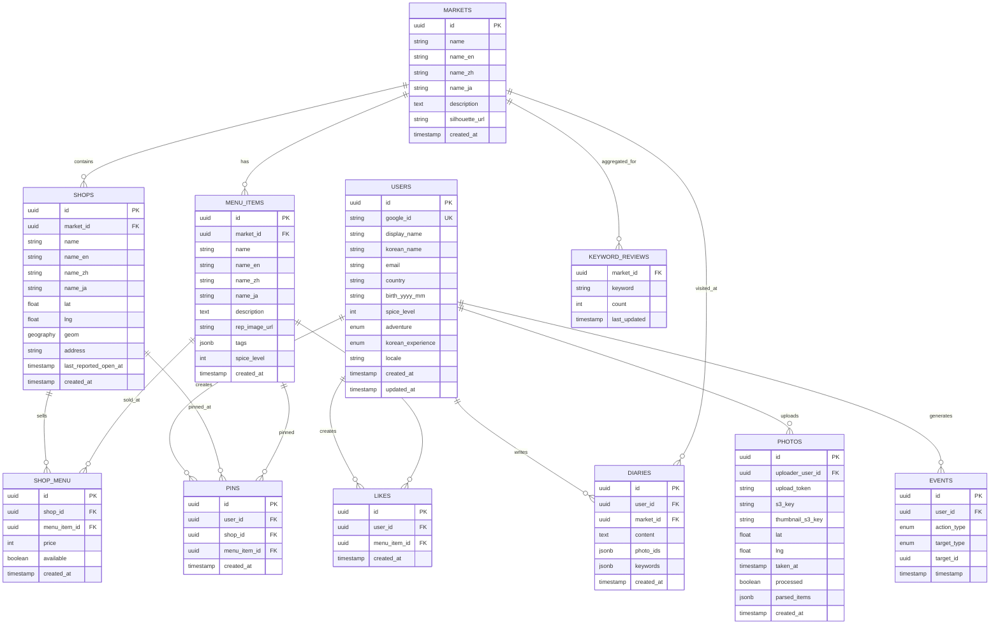

# 🗄️ 데이터베이스 ERD (Entity Relationship Diagram)

## 📊 테이블 구조 및 관계



## 📋 테이블별 상세 설명

### 👥 USERS (사용자)
- **목적**: 서비스 사용자 정보 저장
- **특징**: 
  - Google OAuth 기반 인증
  - 다국어 지원 (locale)
  - 개인화를 위한 선호도 정보 (spice_level, adventure, korean_experience)
- **인덱스**: google_id (UNIQUE)

### 🏪 MARKETS (시장)
- **목적**: 시장 정보 저장
- **특징**: 
  - 다국어 이름 지원
  - 시장 실루엣 이미지 URL
- **관계**: 1:N으로 가게와 메뉴 아이템 포함

### 🏬 SHOPS (가게)
- **목적**: 시장 내 개별 가게 정보
- **특징**: 
  - PostGIS geography 타입으로 정확한 위치 저장
  - 마지막 영업 확인 시간 추적
- **인덱스**: geom (GiST), market_id

### 🍜 MENU_ITEMS (메뉴 아이템)
- **목적**: 시장에서 판매되는 음식 메뉴
- **특징**: 
  - 다국어 이름 및 설명
  - JSONB 태그로 유연한 메타데이터 저장
  - 매운맛 수준 (1-5)
- **관계**: N:M으로 가게와 연결 (SHOP_MENU 통해)

### 🔗 SHOP_MENU (가게-메뉴 연결)
- **목적**: 어떤 가게에서 어떤 메뉴를 얼마에 파는지
- **특징**: 
  - 가격 정보
  - 판매 가능 여부
- **관계**: SHOPS와 MENU_ITEMS를 N:M 연결

### 📸 PHOTOS (사진)
- **목적**: 사용자가 업로드한 사진 정보
- **특징**: 
  - S3 키로 실제 파일 참조
  - AI 분석 결과를 JSONB로 저장
  - 비회원도 업로드 가능 (upload_token 사용)
- **인덱스**: lat, lng (위치 기반 검색용)

### ❤️ LIKES (좋아요)
- **목적**: 사용자의 메뉴 선호도 추적
- **특징**: 
  - 추천 시스템의 핵심 데이터
  - 암시적 피드백 (implicit feedback)
- **인덱스**: user_id, menu_item_id (복합)

### 📌 PINS (핀/북마크)
- **목적**: 사용자가 저장한 가게나 메뉴
- **특징**: 
  - 가게 또는 메뉴 아이템 둘 다 핀 가능
  - NULL 허용으로 유연성 제공

### 📔 DIARIES (다이어리)
- **목적**: 사용자의 시장 방문 기록
- **특징**: 
  - 자유 텍스트 + 키워드 태깅
  - 관련 사진 ID들을 JSONB 배열로 저장

### 🏷️ KEYWORD_REVIEWS (키워드 리뷰 집계)
- **목적**: 시장별 키워드 통계
- **특징**: 
  - 실시간 집계가 아닌 배치 처리로 업데이트
  - 트렌딩 키워드 분석용

### 📊 EVENTS (이벤트)
- **목적**: 사용자 행동 추적
- **특징**: 
  - 추천 시스템 학습 데이터
  - 분석 및 통계용
- **인덱스**: user_id, timestamp (시계열 분석용)

## 🔍 주요 쿼리 패턴

### 1. 반경 검색 (PostGIS)
```sql
SELECT * FROM shops 
WHERE ST_DWithin(
    geom, 
    ST_GeogFromText('POINT(126.9998 37.5703)'), 
    100
);
```

### 2. 협업 필터링 데이터
```sql
SELECT user_id, menu_item_id, 1 as rating 
FROM likes 
WHERE created_at >= NOW() - INTERVAL '30 days';
```

### 3. 인기 메뉴 (가중 점수)
```sql
SELECT m.*, COUNT(l.id) as like_count
FROM menu_items m
LEFT JOIN likes l ON m.id = l.menu_item_id
WHERE l.created_at >= NOW() - INTERVAL '7 days'
GROUP BY m.id
ORDER BY like_count DESC;
```

## 📈 확장 고려사항

### 성능 최적화
- **파티셔닝**: events 테이블을 월별로 파티션
- **인덱싱**: 자주 사용되는 쿼리 패턴에 맞는 복합 인덱스
- **캐싱**: Redis를 통한 자주 조회되는 데이터 캐싱

### 스케일링
- **읽기 복제본**: 읽기 전용 쿼리 분산
- **샤딩**: 지역별 데이터 분산 (향후 다중 도시 지원 시)
- **CQRS**: 명령과 조회 분리

### 데이터 보존 정책
- **사진**: 180일 후 익명화 또는 삭제
- **이벤트**: 1년 후 집계 데이터로 변환
- **개인정보**: GDPR 준수를 위한 삭제 프로세스

---

이 ERD는 MVP 버전을 기준으로 하며, 서비스 성장에 따라 점진적으로 확장될 예정입니다.
